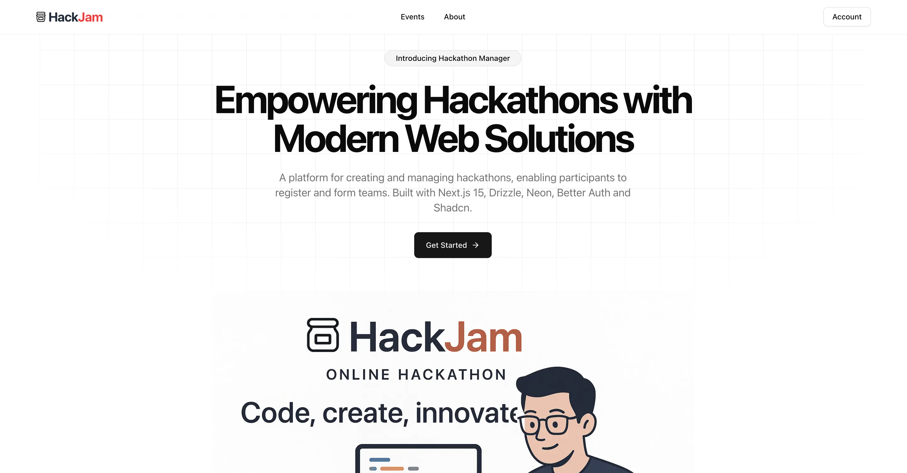
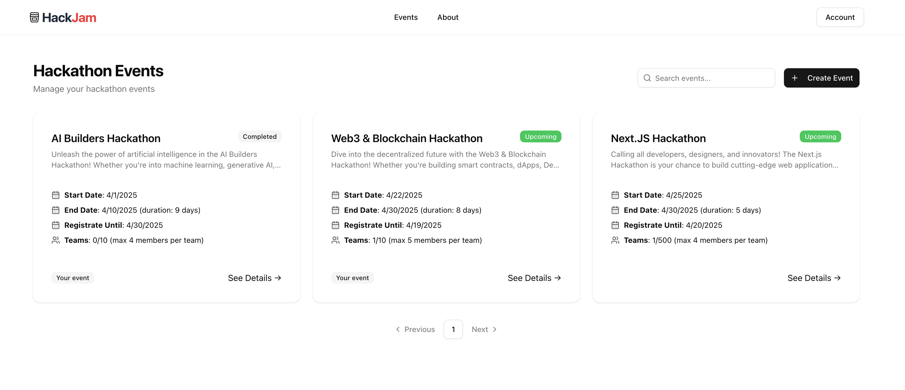
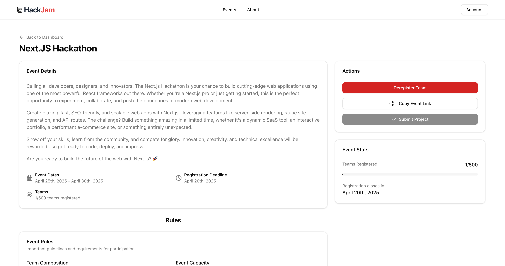
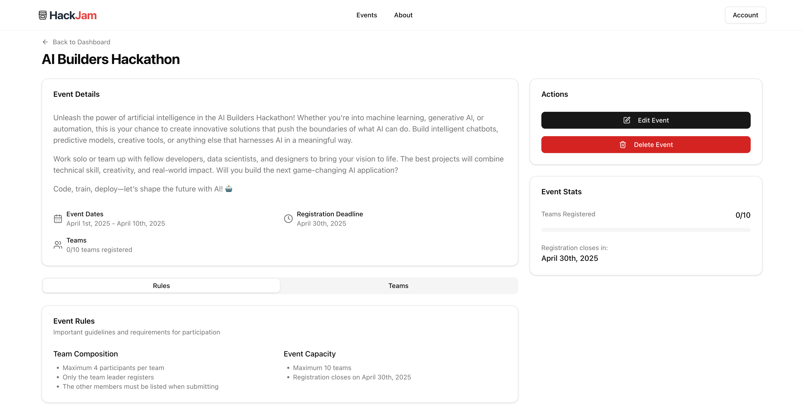
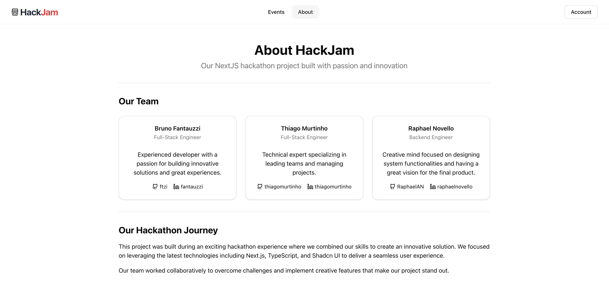

# HackJam

HackJam is a Next.js application that allows you to create and manage your own hackathons. It provides a user-friendly interface for organizing events, managing participants, and tracking submissions.

## About

This is a Next.JS Hackathon submission done by [Bruno Fantauzzi](https://github.com/ftzi), [Thiago Murtinho](https://github.com/thiagomurtinho), and [Raphael Novello](https://github.com/RaphaelAN).

Production URL: https://hackjam-dev.vercel.app

## Screenshots

  
  
  
  
  

## Development

- `bun i`
- `bun env`
- `bun dev`

Open [http://localhost:3000](http://localhost:3000) with your browser to see the result.
